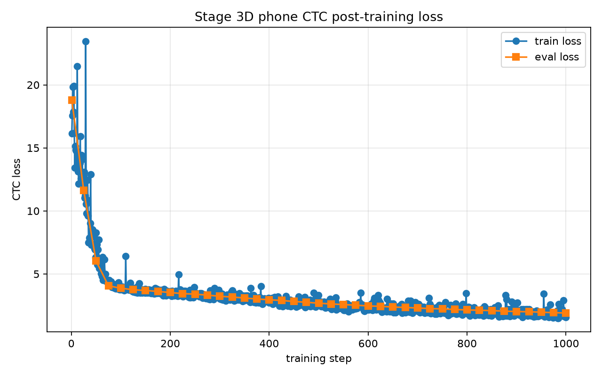

# See My Voice

**See My Voice** is a **web-based Mandarin pronunciation practice app** for
**learners** and **teachers**.

Learners can **record Mandarin speech**, compare it with a **target sentence**,
and review feedback about **clarity**, **rhythm**, **tones**, and **Mandarin
sound units**. Teachers can **assign practice packs**, **review learner
submissions**, **track progress**, and **chat with students**.

## At A Glance

- **Next.js frontend** deployed on **Vercel**
- **Express backend** deployed separately on **Vercel**
- **MongoDB-backed** users, attempts, tasks, reviews, and chat
- **Redis/Vercel KV-backed** HTTP-only cookie sessions
- **Hosted ASR fallback** for the public deployed site
- **Optional trained phone-token model service** for sound-level feedback

## Uploaded Model

The trained **Mandarin phone-token CTC model** has been uploaded to
**Hugging Face**:

https://huggingface.co/sturka/see-my-voice-mandarin-phone-ctc

The latest **local artifact** is:

```text
models/mandarin_phone_ctc_xlsr_chinese_gpu
```

The large **model tensor** is kept out of **Git** and hosted separately.

## What The Model Does

The model learns this mapping:

```text
audio -> Mandarin phone tokens
```

Example labels:

```text
你 ni2  -> I_n F_i T2
好 hao3 -> I_h F_ao T3
爱 ai4  -> F_ai T4
女 nv3  -> I_n F_v T3
是 shi4 -> I_sh F_i_zh T4
字 zi4  -> I_z F_i_z T4
儿 er2  -> F_er T2
```

The app can compare:

```text
expected phone tokens vs predicted phone tokens
```

That creates a path for feedback on **initials**, **finals**, **tones**, and
**full syllable token sequences**.

## Latest Training Run

| Training item | Value |
| --- | --- |
| Base model | `jonatasgrosman/wav2vec2-large-xlsr-53-chinese-zh-cn` |
| Training device | `cuda` |
| Training examples | `300` |
| Validation examples | `50` |
| Training steps | `1000` |
| Phone vocabulary size | `67` |
| Train/validation overlap | `0` |
| Final training loss | `1.5815` |
| Best validation loss | `1.9028` |
| Best validation step | `1000` |
| Validation loss reduction | `89.9%` |

The run used a **pretrained Chinese Wav2Vec2/XLS-R CTC backbone** and adapted it
to the app's **67 Mandarin phone-token labels**. The local **GPU run** kept the
large **acoustic encoder frozen** and trained the **CTC output head**.

## Training Loss

The loss curve below comes from the latest **GPU run**:



**Validation loss** dropped from `18.8047` at the first evaluation to `1.9028`
at step `1000`. **Final training loss** ended at `1.5815`.

## Deployment Modes

### 1. Default Vercel Mode

Use this mode when the **public website** should work without hosting the large
**trained model**.

Backend variables:

```bash
HF_INFERENCE_TOKEN=<your-hugging-face-token>
HF_ASR_MODEL_ID=jonatasgrosman/wav2vec2-large-xlsr-53-chinese-zh-cn
```

This mode provides **text-level feedback** through **hosted ASR**. It does not
provide the trained phone-token model's **initial**, **final**, and **tone**
predictions.

### 2. Optional Trained Model Mode

Use this mode when **sound-level feedback** from the trained **See My Voice
phone-token model** is needed.

Deploy the **pronunciation API service**:

```bash
source .venv/bin/activate
python tools/deploy_hf_pronunciation_api.py
```

Then set the **backend environment variable**:

```bash
PRONUNCIATION_API_URL=https://<your-pronunciation-service>
```

If **Hugging Face** blocks **Docker Spaces** on the current account plan, run
the model **locally** and expose it with a **tunnel** while testing:

```bash
SEE_MY_VOICE_PHONE_CTC_MODEL_DIR=models/mandarin_phone_ctc_xlsr_chinese_gpu \
PORT=7860 \
python web/server.py

cloudflared tunnel --url http://localhost:7860
```

## Backend Environment

Required **production variables**:

```bash
MONGODB_URI=mongodb+srv://...
MONGODB_DB=see_my_voice
KV_REST_API_URL=https://...
KV_REST_API_TOKEN=<vercel-kv-token>
FRONTEND_ORIGIN=https://<your-frontend-project>.vercel.app
```

Optional variables:

```bash
AUTH_SESSION_TTL_SECONDS=604800
HF_INFERENCE_TOKEN=<optional-hosted-asr-token>
HF_ASR_MODEL_ID=jonatasgrosman/wav2vec2-large-xlsr-53-chinese-zh-cn
PRONUNCIATION_API_URL=https://<optional-trained-model-service>
```

`AUTH_SESSION_TTL_SECONDS=604800` means **login sessions last 7 days**. The code
already defaults to **7 days** if this variable is not set.

## Frontend Environment

Set the backend target for the Next.js API rewrite:

```bash
NEXT_PUBLIC_API_BASE_URL=https://<your-backend-project>.vercel.app
```

The frontend sends browser requests to same-origin `/api/...` by default, and
Next.js rewrites them to the backend. This keeps auth cookies first-party for
mobile browsers. Use `NEXT_PUBLIC_API_MODE=direct` only when you intentionally
want the browser to call the backend origin directly.

## Project Structure

```text
frontend/   Next.js web app
backend/    Express API for auth, tasks, chat, attempts, and reviews
src/        Training, labeling, and inference scripts
web/        Local Python pronunciation prototype server
models/     Local trained artifacts, ignored by Git
deploy/     Hugging Face pronunciation API deployment template
docs/       Reports and visual assets
```

## Training Pipeline

The training pipeline includes:

- **Fixed 67-token Mandarin phone vocabulary**
- **Dataset manifest** with audio paths, text, pinyin, and phone-token labels
- **CTC loss training**
- **CUDA/GPU execution** through PyTorch
- **Validation loss tracking**
- **Early stopping support**
- **Saved model artifacts**
- **Saved loss history and loss graph**

Core **training script**:

```text
src/run_stage3d_train_phone_ctc.py
```
